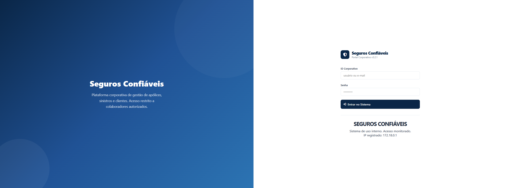

# Seguros Confiáveis - Laboratório de Segurança Ofensiva



## Visão Geral

O **Seguros Confiáveis** é um ambiente controlado, projetado com "vulnerabilidades por design" para fins educacionais e treinamento em cibersegurança. Ele simula um portal corporativo de seguros com falhas de segurança intencionais, proporcionando um cenário realista para que profissionais e estudantes pratiquem técnicas de segurança ofensiva.

Todo o laboratório opera dentro de uma arquitetura de containers (Docker), garantindo isolamento total e risco zero para o ambiente host.

## Principais Características

*   **Persona Corporativa**: Narrativa de uma empresa de seguros fictícia com identidade visual consistente.
*   **Arquitetura Modular**: Estrutura de projeto organizada seguindo as melhores práticas de PHP.
*   **Pronto para Testes**: Banco de dados pré-carregado com usuários, clientes e registros de apólices.
*   **Isolado**: Configuração em Docker garante portabilidade e segurança.

## Vulnerabilidades Incluídas

As seguintes falhas intencionais estão disponíveis para exploração:

*   **SQL Injection (SQLi)**: Bypass de autenticação (Login) e extração via UNION (Busca de Apólices).
*   **Cross-Site Scripting (XSS)**: Refletido (Mecanismo de busca) e Armazenado (Cadastro de clientes).
*   **Local File Inclusion (LFI)**: Leitura de arquivos arbitrários através do visualizador de logs.
*   **Upload de Arquivo Inseguro**: Ausência de validação de extensão para prática de shells reversas.
*   **Exposição de Informações**: Revelação de metadados técnicos do servidor e detalhes do ambiente.

## Implementação / Execução

### Configuração em um Único Comando

Selecione o comando correspondente ao seu sistema operacional para instalar dependências automaticamente (se faltarem) e iniciar o laboratório:

#### Windows (PowerShell como Admin)
```powershell
if (!(Get-Command docker -ErrorAction SilentlyContinue)) { winget install --accept-source-agreements --accept-package-agreements Docker.DockerDesktop }; docker info *>$null; if (-not $?) { Start-Process "$env:ProgramFiles\Docker\Docker\Docker Desktop.exe"; Write-Host "`n⏳ Aguardando Docker..." -ForegroundColor Yellow; do { Start-Sleep 3; docker info *>$null } until ($?) }; if (!(Test-Path vulnerable-webservice)) { git clone https://github.com/pedrosilvaevangelista/vulnerable-webservice.git }; cd vulnerable-webservice; git pull; docker compose down *>$null; docker compose up -d --build
```

#### Linux (Debian / Ubuntu)
```bash
command -v docker > /dev/null || { curl -fsSL https://get.docker.com | sudo sh; }; sudo systemctl start docker; [ ! -d "vulnerable-webservice" ] && git clone https://github.com/pedrosilvaevangelista/vulnerable-webservice.git; cd vulnerable-webservice; git pull; sudo docker compose down 2>/dev/null; sudo docker compose up -d --build
```

#### Kali Linux
```bash
command -v docker > /dev/null || { sudo rm -f /etc/apt/sources.list.d/docker.list; sudo apt update; sudo apt install -y ca-certificates curl gnupg; sudo install -m 0755 -d /etc/apt/keyrings; curl -fsSL https://download.docker.com/linux/debian/gpg | sudo gpg --dearmor -o /etc/apt/keyrings/docker.gpg; sudo chmod a+r /etc/apt/keyrings/docker.gpg; echo "deb [arch=amd64 signed-by=/etc/apt/keyrings/docker.gpg] https://download.debian.net/debian bookworm stable" | sudo tee /etc/apt/sources.list.d/docker.list > /dev/null; sudo apt update; sudo apt install -y docker-ce docker-ce-cli containerd.io docker-compose-plugin; }; sudo systemctl start docker; [ ! -d "vulnerable-webservice" ] && git clone https://github.com/pedrosilvaevangelista/vulnerable-webservice.git; cd vulnerable-webservice; git pull; sudo docker compose down 2>/dev/null; sudo docker compose up -d --build
```

### Acessando o Portal

Após a execução, a aplicação estará disponível em:
[http://localhost:8080](http://localhost:8080)

## Aviso de Segurança

> [!CAUTION]
> **ESTE AMBIENTE É INSEGURO POR DESIGN.**
> * Nunca publique este laboratório em redes abertas ou servidores de produção.
> * Use estritamente para fins educacionais em ambientes isolados.
> * Todas as vulnerabilidades estão contidas dentro de volumes Docker.
> * O uso indevido das técnicas aqui exploradas é de total responsabilidade do usuário.

---

**PinkMan** - *Entusiasta de Cibersegurança*
[Perfil no GitHub](https://github.com/pedrosilvaevangelista)
